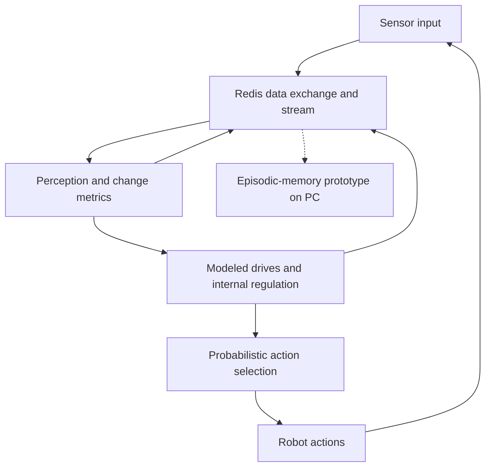

# Fidge

> **An experimental robotics project combining sensor processing, modeled drives, and probabilistic action selection**

Fidge is a physical robot built to explore how sensory feedback and changing internal states can shape behavior. It moves, produces sounds, and enters sleep states without step-by-step user commands. Its next action is selected probabilistically within a designed system of drives, constraints, and feedback mechanisms.

Most modules run on a Raspberry Pi. Selected components, including the episodic-memory prototype, are hosted on a separate PC. This README presents the project concept, architecture, and current development status.

## Project Idea

Fidge began as an independently developed concept for a biologically inspired robot: a system in which perception, internal regulation, and action selection continually influence one another.

The design takes inspiration from early sensorimotor development, particularly repetition, habituation, and learning from the effects of an action. Biological concepts provide a framework for organizing the software into interacting modules.

The practical focus is on connecting these modules to real hardware and observing how their interaction affects behavior. Current development concentrates on sensor tuning and basic adaptive mechanisms.

## Current Development Status

**Running** describes functionality used in the physical prototype. **Early-stage** describes limited adaptive behavior still under development. **Prototype** describes components that have been developed but are not yet validated.

| Component | Status | Scope |
| :--- | :--- | :--- |
| **Physical robot** | Running | Movement, sound output, and software-controlled sleep states. |
| **Sensor processing** | Running; being refined | Sensor inputs are processed into change metrics and derived states. Sensor tuning is the current development focus. |
| **Internal state model** | Running | Thirteen modeled drives interact with simulated neurochemical variables, needs, and energy regulation. |
| **Action selection** | Running | Probabilistic selection influenced by internal states and feedback, without an operator choosing each next action. |
| **Habituation and adaptation** | Early-stage | Programmed habituation and basic success-oriented feedback influence behavior within predefined mechanisms. |
| **Distributed execution** | Running | Most modules run on the Raspberry Pi; selected components are hosted on a PC. |
| **Episodic memory** | Prototype; untested | A pipeline for forming, storing, and comparing episodes has been developed. Training for reliable episode recognition is still pending. |

## How Behavior Is Selected

### From sensor input to internal state

Processing modules evaluate sensor readings and changes over time. Thirteen modeled drives represent factors such as novelty, predictability, safety, and overstimulation. These values interact with simulated neurotransmitter and hormone variables, as well as modeled needs and energy levels.

These are computational variables used to influence behavior. Their biological names describe the inspiration behind the design.

### Probabilistic action selection

The action system uses a two-level structure: selecting a motivating drive, then selecting an action. The architecture includes exploration, need-related behavior, practice, and energy recovery. Weights and constraints change with the current state.

This allows behavior to vary without requiring a user to issue each command. Available actions, evaluation criteria, and adaptation rules are defined by the implementation.

### Early adaptation

Current adaptation is limited to programmed habituation and basic success-oriented mechanisms. Repetition and feedback affect action selection, with success evaluated against predefined drive-related criteria.

This is an early form of adaptation. Its effectiveness and consistency have not yet been established through systematic evaluation.

## Architecture and Data Flow

Python modules exchange sensor data and derived states through Redis. A Redis Stream carries time-series data through the system. The diagram summarizes the functional relationships; it does not imply a strictly sequential execution schedule.

The solid loop represents the behavior architecture. The dashed branch marks the untested memory prototype; it is not presented as a validated memory-based learning loop.

## Episodic-Memory Prototype

The memory module is designed to turn sequences of sensor and state data into stored episodes. Its documented pipeline includes feature extraction, normalization, episode segmentation, SQLite storage, and similarity search.

The initial episode representation uses statistical features such as mean, standard deviation, minimum, and maximum. These vectors can be compared using cosine similarity. They do not require a trained neural encoder.

The broader memory system remains untested, and no models have been trained. Training for reliable episode recognition is a next development step. Memory-guided behavior and replay remain development goals.

## Technology Stack

| Area | Technology | Role |
| :--- | :--- | :--- |
| Main runtime | Raspberry Pi, Python | Execution of most processing and behavior modules |
| Additional compute | Separate PC | Hosting selected components, including the memory prototype |
| Module communication | Redis, Redis Streams | Exchange of sensor data, derived states, and time-series data |
| Episode storage | SQLite | Persistent storage in the memory prototype |
| Episode representation | Statistical feature vectors | Compact representation of recorded sequences |
| Similarity search | Cosine similarity | Comparison of episode vectors in the memory prototype |

## Development Focus and Limits

Fidge is a working experimental prototype. Current priorities are refining sensor input, testing the episodic-memory pipeline, and evaluating the behavior produced by the interacting modules.

The project currently demonstrates physical operation and state-dependent action selection. Learning performance, episode-recognition quality, and long-term behavioral stability remain to be evaluated.

## Project Contribution

**Stefanie Wolf:** Original idea, end-to-end system conception, architecture, hardware integration, and iterative sensor and behavior tuning.

The code was generated through collaboration with four AI systems; no code was written manually. My contribution centers on defining the system, directing the AI-assisted implementation, bringing the components together, and refining their behavior on physical hardware.

