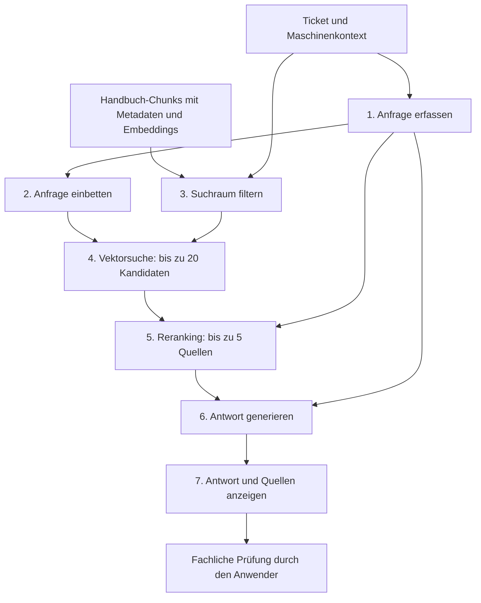

# SAM – Service-Assistenz-Modell

> **Smart Assistance for Machinery: RAG-basierte KI-Assistenz für den industriellen Service**

**[Live-Demo öffnen](https://sam-rag-showcase.onrender.com)**

SAM ist ein Praxis- und Demoprojekt für den KI-Manager-Stammtisch und die Projektpräsentation. Es zeigt, wie technische Dokumentation mit einem ticketbasierten Supportablauf verbunden werden kann. Dieses Verzeichnis stellt Idee und Architektur vor; der Quellcode ist nicht Bestandteil dieser Portfolio-Dokumentation.

## Ausgangspunkt

Ein Fehlercode allein reicht häufig nicht aus, um die passende Information zu finden. Maschinenserie, Baujahr, Steuereinheit und Softwarestand bestimmen, welche Dokumentation relevant ist.

SAM veranschaulicht diese Herausforderung anhand der XY-Serie: Eine Anfrage zur XY-500 von 2019 soll nicht versehentlich mit Informationen einer anderen Serie oder eines anderen Baujahrs beantwortet werden.

Das Ziel ist, relevante Handbuchauszüge gezielt zu finden, zu einer verständlichen Antwort zusammenzuführen und zur Prüfung zugänglich zu machen.

## Was die Demo zeigt

- **Ticketbasierter Einstieg:** Mitarbeiterauswahl und Ticket übernehmen den Maschinenkontext in die Anfrageoberfläche.
- **Eingegrenzte Dokumentensuche:** Maschinenserie, Baujahr und Dokumenttyp dienen als Filter für die Suche.
- **Zweistufige Auswahl:** Eine Vektorsuche liefert Kandidaten; ein Reranker bewertet diese erneut zusammen mit der Originalfrage.
- **Quellengestützte Antworten:** Antwortvorschläge werden mit Kapitel-, Seiten- und Textverweisen zur Prüfung dargestellt.
- **Einblick in die Verarbeitung:** Die Oberfläche visualisiert sieben Pipeline-Schritte mit ergänzenden Informationen und Detailansichten.
- **Präsentationsmodus:** KI-Parameter und Zwischenergebnisse machen Architekturentscheidungen diskutierbar.

## So lässt sich SAM erkunden

1. Einen Mitarbeitereintrag und ein Ticket auswählen.
2. Maschinenserie, Baujahr und Dokumenttyp prüfen.
3. Die Anfrage bei Bedarf mit den angebotenen Textbausteinen ergänzen und absenden.
4. Die Verarbeitung in der Pipeline verfolgen und Detailansichten öffnen.
5. Antwort und zugehörige Quellen vergleichen.

## Architektur und Datenfluss

Die Abfolge und Parameter beschreiben den dokumentierten Demoaufbau. Die Anzahl verfügbarer Treffer hängt vom gefilterten Datenbestand ab.

### Warum Retrieval und Reranking?

Die erste Suchstufe vergleicht die Vektorrepräsentation der Anfrage mit den vorbereiteten Dokument-Chunks. In der zweiten Stufe verarbeitet ein Cross-Encoder jeweils die Frage und einen Kandidatentext gemeinsam, um die Treffer neu zu ordnen.

Diese Aufteilung soll eine breite Kandidatensuche mit einer gezielteren Auswahl für den Antwortkontext verbinden. Ob und wie stark sie die Antwortqualität verbessert, muss anhand repräsentativer Testfälle bewertet werden.

### Quellen und menschliche Prüfung

Das Sprachmodell erhält die ausgewählten Quellen mit der Vorgabe, seine Antwort darauf zu stützen. Quellenkarten ermöglichen den Vergleich mit den zugrunde liegenden Texten.

Die Oberfläche unterstützt damit eine menschliche Prüfung. Das Anzeigen von Quellen allein ist jedoch noch kein technisch erzwungener Freigabeprozess. Ebenso garantiert eine Prompt-Vorgabe keine fehlerfreie oder ausschließlich quellengestützte Antwort.

## Technologie-Stack

| Bereich | Technologie laut Projektarchitektur | Aufgabe |
| :--- | :--- | :--- |
| Oberfläche | HTML5, CSS, JavaScript | Ticketansicht, Anfrage, Pipeline und Quellendarstellung |
| Backend | Python 3.13, Flask 3.1, Flask-CORS | API und RAG-Orchestrierung |
| Streaming | Server-Sent Events (SSE) | Übertragung von Verarbeitungsereignissen und Ausgaben |
| Embeddings | Google `gemini-embedding-001` | Vektorrepräsentationen, im beschriebenen Aufbau mit 3072 Dimensionen |
| Vektorsuche | NumPy, normalisierte In-Memory-Vektormatrix | Ähnlichkeitssuche mittels Cosine Similarity |
| Reranking | `cross-encoder/ms-marco-MiniLM-L-6-v2` | Neubewertung der Kandidaten anhand von Frage und Text |
| Antwortgenerierung | Google Gemini `gemini-3.5-flash` | Formulierung eines Antwortvorschlags aus dem Quellenkontext |
| Hosting | Render | Bereitstellung der öffentlichen Demo |

## Datenmodell

**Dokument-Chunks** enthalten Text, Titel und Metadaten wie Maschinenserie, Baujahr, Softwareversion, Dokumenttyp, Kapitel und Seite. **Tickets** verknüpfen Anfrage und Fehlercode mit Maschinenkontext, Priorität, Bearbeitungsstatus und ergänzenden Textbausteinen.

Die Unterscheidung ist wesentlich: Ein gespeicherter Softwarestand ist nicht automatisch ein wirksamer Suchfilter. Die dokumentierte Filterung berücksichtigt Serie, Baujahr und Dokumenttyp; weitere Kompatibilitätsregeln müssen ausdrücklich umgesetzt und geprüft werden.

## Entwicklungsstand und Grenzen

SAM ist eine interaktive Projektdemo, keine für den industriellen Betrieb freigegebene Serviceanwendung. Die Dokumentation beschreibt den Projektaufbau und enthält keine unabhängig verifizierten Aussagen zu Genauigkeit, Zeitersparnis oder Produktionsreife.

Für die Bewertung stehen insbesondere folgende Fragen im Vordergrund:

- Werden Dokumente anderer Serien und Baujahre zuverlässig ausgeschlossen?
- Welche Wirkung hat das Reranking auf deutschsprachige technische Anfragen?
- Wie verhält sich SAM bei fehlenden, widersprüchlichen oder unzureichenden Quellen?
- Stimmen Quellenbelege und vorgeschlagene Maßnahmen tatsächlich überein?

Die Handbuchauszüge und Tickets dienen der Demonstration. Die Demo ersetzt weder freigegebene Herstellerunterlagen noch die fachliche Prüfung von Arbeiten an Maschinen. Bitte ausschließlich mit fiktiven Anfragen testen und keine vertraulichen Betriebs- oder Kundendaten eingeben.

## Projektbeitrag

**Stefanie Wolf:** Konzeption und KI-gestützte prototypische Umsetzung eines RAG-basierten Supportsystems – von der betrieblichen Fragestellung über die Strukturierung des Informationsflusses bis zur interaktiven Demonstration.

Das Projekt verbindet technisches Lösungsdesign mit der Perspektive des Servicepersonals: Die Suche beginnt im konkreten Arbeitsfall, und die Antwort bleibt anhand ihrer Quellen überprüfbar.
